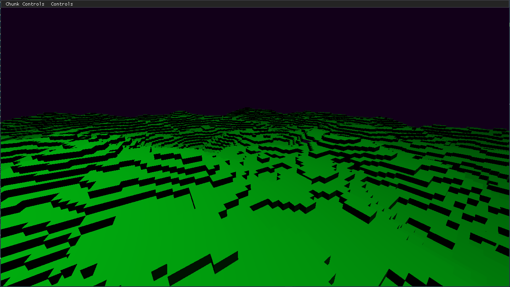

# Prism Game Engine
<p align="center">
  <a href="#">
    
  </a>
</p>

## Description
#### NOTE: Still not ready to build for linux due to compiler issues
My take on a 3D game engine, something i have been working on for quite a while as a hobby project also as a school assignment. 
Mainly working on it to learn game engine development and modern c++ techniques. Key focus being rouge like mechanics.
The current version is very barebones and more like a OpenGL wrapper, the key tasks other than planned features would be:
* Better error handling and asserts on the release build
* Rditor and engine separation
* Scene graph
* ECS integration

## Planned Features
* #### Major rewrite/redesign planned
* Scene Renderer
* Deffered Shading
* Shadow Mapping
* Post Processing (AO, Bloom, ect...)
* Multithreaded Game Event System
* Multithreaded Rendering Queue
* Procedural Level/World Generation
* [Audio Engine (OpenAL)](https://www.openal.org/)
* [Networking Layer (Asio)](https://think-async.com/Asio/)
* Embeded Scripting Language probably lua

## Getting Started
Clone the repository and get all the submodules 

```bash
git clone --recursive https://github.com/stojanov/prism
cd prism
```

It is ment to but run directly into an IDE that supports the cmake system, you can also try to generate the project files manually

```bash
# Unix
cmake ./
# Windows
cmake -G "Visual Studio 16" -A "Win64" ./
```

Once you compile you will be ready to peek around the source code, the best way to start is of course `main.cpp` found under `src/game/main.cpp`:

```
Prism::Application app(1280, 720, "Prism");
	
app.CreateLayer<Prism::Examples::VoxelExample>("Voxel Example");
	
app.Run();
```

Here we can attach a layer/state to be run on the engine, create a layer and plug it into the `Prism::Application`, that should fairly simple just follow the interface 
`src/prism/Interfaces/ILayer.h` which contains the base methods for running a layer.

Keep in mind that every layer should have a constructor that recives a `Ref<Core::SharedContext>` and a name, 
you can check out some of the  `src/prism/Examples` for implementing a layer.

## Built in systems
* ##### Voxels
    
    * Voxel mesh generation based on a height map(Perlin Noise) and infinite world generation
    * All of the voxel modules can be found under the `src/prism/Voxels`
    * Chunk mesh generation only supports generating a mesh for a height map but will add more features in the future
    * Chunk mesh generation offloaded into a background thread via a thread pool can be found in `src/prism/Voxels/ChunkManager.cpp`

## Work in Progress
* Major Refactor/Restructure
* Camera System/Controller Rework
* Entity Component System
* Base Editor Controls
* Better documentation

## Changelog
* Added a base entity component system (The system part is still under development)
* Added [phmap](https://github.com/greg7mdp/parallel-hashmap) as a module

## Credits
[TheCherno](https://www.youtube.com/user/TheChernoProject)
[ChiliTomatoNoodle](https://www.youtube.com/user/ChiliTomatoNoodle)
[TheThinMatrix](https://www.youtube.com/user/ThinMatrix)
[Hopson for the inpiration](https://www.youtube.com/channel/UCeQhZOvNKSBRU0Mdg7V44wA)


## License
[GPL](https://choosealicense.com/licenses/gpl-3.0/)